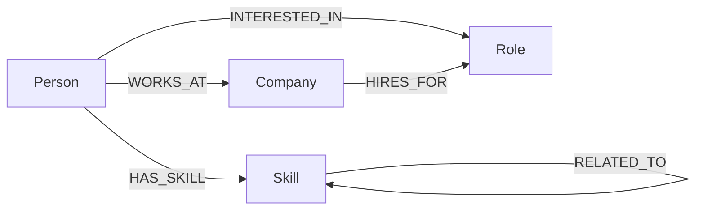

# SkillGraph

Find a mentor at work. Open an employee, see their skills, and get ranked teammates who share those skills.

This is like [Together](https://www.togetherplatform.com/): companies help new hires find a mentor inside the org.

MongoDB is replaced by **CognoDB** (Neo4j-compatible). Data is a graph. Queries are Cypher.

## Use case

New hires often do not know who to ask. SkillGraph uses the company skill network to answer:

- **Who can mentor Maya?** People who share her skills.
- **What should she learn next?** Skills next to hers (`RELATED_TO`).
- **How can she get an intro to Tess?** The shortest chain through people, skills, companies, and roles.

No login. Seed data is the directory. Rank = how many skills two people both have (not interviews or ratings).

## Why a graph database?

These questions are **links between people**, not one table row.

In SQL or Mongo you need many join tables (`person_skills`, companies, roles, related skills). Finding mentors is a self-join. A 6-step intro path needs recursive queries and still extra work to draw the trail.

A graph stores people, skills, companies, and roles as **nodes**, and `HAS_SKILL` / `WORKS_AT` as **edges**. CognoDB speaks Bolt + Cypher, so this app uses `neo4j-driver`. Mentor match is one walk: person → skill ← other person. Rank is `size(sharedSkills)`. Intros use `shortestPath`. New skill links show up on the next request — no cached mentor table.

| App question | Graph | Tables |
| ------------ | ----- | ------ |
| Mentors | 2 hops through a skill | Self-join + count |
| Learn next | Neighbor skills | Extra join |
| Intro path | `shortestPath` | Recursive CTE |

## Data model



Example: Maya and Ava both have React → Ava can mentor Maya. React is related to TypeScript → a “learn next” hint.

| Node | Meaning | Relationship | Meaning |
| ---- | ------- | ------------ | ------- |
| Person | Employee | `HAS_SKILL` | Person knows a skill |
| Skill | Capability | `WORKS_AT` | Person works at a company |
| Company | Employer | `INTERESTED_IN` | Person wants a role |
| Role | Job target | `HIRES_FOR` | Company hires for a role |
| | | `RELATED_TO` | Two skills are close |

Seed (`MERGE`, safe to re-run): 20 people, 20 skills, 8 companies, 10 roles.

## Setup and run

### Create a CognoDB instance

1. Sign up at [cognodb.com](https://cognodb.com/) ([docs](https://cognodb.com/docs)).
2. Create a **free c0** instance and pick a region (ready in about a minute).
3. Copy **URI** (`bolt+s://….databases.cognodb.cloud`), **user** (`cognodb`), and **password** (shown once).

### Install

Node 18+. From the repo root:

```bash
npm install
```

### Env

`.env` is gitignored. Create one in the **repo root**:

```env
NEO4J_URI=bolt+s://YOUR_INSTANCE.databases.cognodb.cloud
NEO4J_USER=cognodb
NEO4J_PASSWORD=your-password-here
PORT=4000
NODE_ENV=development
CORS_ORIGIN=http://localhost:5173
```

Optional `frontend/.env`: `VITE_API_BASE_URL=http://localhost:4000` (default is already that).

### Seed and start

```bash
npm run seed
npm run dev
```

- App: http://localhost:5173
- Health: http://localhost:4000/api/health
- Counts: http://localhost:4000/api/graph/stats

Build: `npm run build` (not `npm build`).

## Main queries

Cypher is in `backend/src/infrastructure/neo4j/cypher/queries.ts`. Values go in as `$id`, `$from`, `$to` — not string concat. The UI does not show Cypher.

**Mentors** — walk out to skills, back to other people. More shared skills = higher rank.

```cypher
MATCH (seeker:Person {id: $id})-[:HAS_SKILL]->(shared:Skill)<-[:HAS_SKILL]-(mentor:Person)
WHERE mentor.id <> seeker.id
RETURN mentor, collect(DISTINCT shared) AS sharedSkills
ORDER BY size(sharedSkills) DESC
```

**Learn next** — skills linked to yours that you do not already have.

```cypher
MATCH (p:Person {id: $id})-[:HAS_SKILL]->(owned:Skill)-[:RELATED_TO]-(related:Skill)
WHERE NOT (p)-[:HAS_SKILL]->(related)
RETURN DISTINCT related, owned.name AS via
```

**Connect** — shortest path, max 6 steps, mixed link types.

```cypher
MATCH (from:Person {id: $from}), (to:Person {id: $to})
MATCH path = shortestPath(
  (from)-[:HAS_SKILL|WORKS_AT|INTERESTED_IN|HIRES_FOR|RELATED_TO*..6]-(to)
)
RETURN path
```

After seed: profile `/people/p-maya`, API `GET /api/people/p-maya/mentors`, Connect Maya (`p-maya`) → Tess (`p-tess`).

## Screens

Walk: Directory → open a profile → Mentor matches → Connect for the intro trail.

**Home** — what the product does


**Directory** — search people, then open a profile


**Profile** — skills, company, and related skills


**Mentor matches** — ranked by shared skills (rank 1 = best match)


**Connect** — shortest path between two people


## API

| Method | Path | Purpose |
| ------ | ---- | ------- |
| GET | `/api/health` | App + CognoDB |
| GET | `/api/graph/stats` | Node / relationship counts |
| GET | `/api/people?q=` | Search people |
| GET | `/api/people/:id` | Profile |
| GET | `/api/people/:id/mentors` | Shared-skill mentors |
| GET | `/api/people/:id/related-skills` | Learn-next skills |
| GET | `/api/paths?from=&to=` | Shortest path |

`backend/` = API (Cypher only in the repository). `frontend/` = React UI. No auth, no Mongo.
